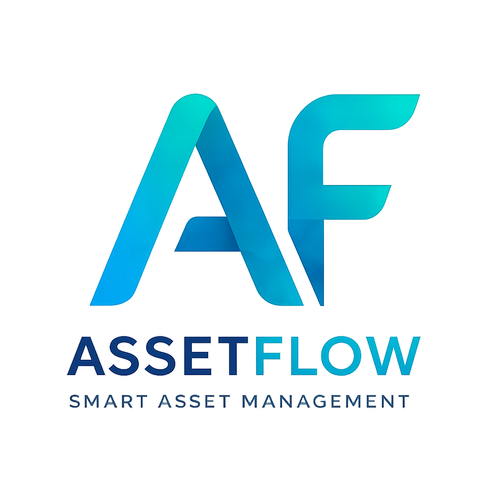

# AssetFlow

<div align="center">



# Enterprise Asset & Resource Management System

### **Track • Allocate • Maintain**

*A centralized ERP platform for managing enterprise assets, shared resources, maintenance workflows, audits, and operational analytics.*


</div>

---

# 📖 Overview

AssetFlow is a modern **Enterprise Asset & Resource Management System (ERP)** built to simplify how organizations register, allocate, maintain, audit, and monitor physical assets.

Instead of relying on spreadsheets or paper logs, AssetFlow provides a centralized platform with role-based workflows, asset lifecycle management, resource booking, maintenance approvals, audit cycles, dashboards, and analytics.

The platform is designed to be industry-independent and can be used by:

- 🏢 Enterprises
- 🏫 Educational Institutions
- 🏥 Hospitals
- 🏭 Manufacturing Industries
- 🏛 Government Organizations
- 🏢 Corporate Offices

---

# ✨ Features

## 🔐 Authentication

- Secure Login
- Employee Signup
- JWT Authentication
- Password Encryption (bcrypt)
- Role Based Access Control (RBAC)

---

## 📊 Dashboard

Real-time operational insights including:

- Assets Available
- Assets Allocated
- Maintenance Today
- Active Bookings
- Pending Transfers
- Upcoming Returns
- Overdue Returns

Visualizations

- Asset Utilization
- Maintenance Trends
- Department Summary
- Recent Activities
- Notifications

---

## 🏢 Organization Setup

### Departments

- Create Department
- Edit Department
- Department Hierarchy
- Assign Department Head
- Activate / Deactivate

### Asset Categories

- Electronics
- Furniture
- Vehicles
- Office Equipment
- Custom Categories

### Employee Directory

- Employee Management
- Role Assignment
- Department Mapping
- Status Management

---

## 💻 Asset Management

Manage complete asset lifecycle.

- Register Assets
- Asset Tag Generation
- Serial Numbers
- Asset Images
- Location Tracking
- Condition Tracking
- Asset History

Lifecycle Status

- Available
- Allocated
- Reserved
- Under Maintenance
- Lost
- Retired
- Disposed

---

## 📦 Asset Allocation

- Allocate Assets
- Return Assets
- Transfer Requests
- Allocation History
- Expected Return Date
- Conflict Validation

---

## 📅 Resource Booking

Book shared resources.

Examples

- Meeting Rooms
- Conference Rooms
- Projectors
- Company Vehicles

Supports

- Calendar View
- Time Slot Booking
- Overlap Validation
- Booking Status
- Reminders

---

## 🔧 Maintenance

Maintenance Workflow

```text
Pending
   │
Approved
   │
Technician Assigned
   │
In Progress
   │
Resolved
```

Features

- Raise Request
- Approval Workflow
- Technician Assignment
- Asset Status Updates
- Maintenance History

---

## 📋 Asset Audit

- Audit Cycle Creation
- Auditor Assignment
- Asset Verification
- Discrepancy Reports
- Audit History

---

## 📈 Reports

Generate insights for

- Asset Utilization
- Department Allocation
- Maintenance Frequency
- Booking Heatmaps
- Idle Assets
- Upcoming Maintenance

---

## 🔔 Notifications

Real-time notifications

- Asset Assigned
- Booking Reminder
- Maintenance Approved
- Transfer Approved
- Audit Completed
- Overdue Return Alerts

---

# 👥 User Roles

## 👑 Admin

- Manage Departments
- Manage Categories
- Manage Employees
- Assign Roles
- View Reports
- Create Audit Cycles

---

## 📦 Asset Manager

- Register Assets
- Allocate Assets
- Approve Transfers
- Approve Maintenance
- Verify Returns

---

## 🏢 Department Head

- Department Assets
- Department Approvals
- Book Resources

---

## 👨‍💼 Employee

- View Assigned Assets
- Raise Maintenance Requests
- Book Resources
- Request Transfers
- Initiate Returns

---

# 🛠 Tech Stack

## Frontend

- React (Vite)
- React Router
- Axios
- React Context API
- CSS Modules / Vanilla CSS
- Recharts

---

## Backend

- Express.js
- Prisma ORM

---

## Database

- PostgreSQL
- Neon Database

---

## Authentication

- JWT
- bcrypt

---

## Deployment

| Service | Platform |
|----------|----------|
| Frontend | Vercel |
| Backend | Render |
| Database | Neon PostgreSQL |

---

# 📂 Project Structure

```text
AssetFlow
│
├── client/
│   │
│   ├── src/
│   │   │
│   │   ├── assets/
│   │   │
│   │   ├── components/
│   │   │   ├── Sidebar/
│   │   │   ├── Navbar/
│   │   │   ├── Cards/
│   │   │   ├── Table/
│   │   │   ├── Modal/
│   │   │   ├── Button/
│   │   │   ├── Input/
│   │   │   └── Loader/
│   │   │
│   │   ├── layouts/
│   │   │   └── DashboardLayout.jsx
│   │   │
│   │   ├── pages/
│   │   │   ├── Login/
│   │   │   ├── Dashboard/
│   │   │   ├── Assets/
│   │   │   ├── Employees/
│   │   │   ├── Departments/
│   │   │   ├── Categories/
│   │   │   ├── Allocation/
│   │   │   ├── Booking/
│   │   │   ├── Maintenance/
│   │   │   ├── Audit/
│   │   │   ├── Reports/
│   │   │   └── Notifications/
│   │   │
│   │   ├── services/
│   │   │   ├── api.js
│   │   │   ├── auth.js
│   │   │   ├── asset.js
│   │   │   ├── booking.js
│   │   │   └── employee.js
│   │   │
│   │   ├── hooks/
│   │   ├── context/
│   │   │   └── AuthContext.jsx
│   │   ├── styles/
│   │   ├── utils/
│   │   └── App.jsx
│   │
│   └── package.json
│
├── server/
│   │
│   ├── src/
│   │   │
│   │   ├── config/
│   │   │   └── prisma.js
│   │   │
│   │   ├── middleware/
│   │   │   ├── auth.js
│   │   │   ├── role.js
│   │   │   └── error.js
│   │   │
│   │   ├── routes/
│   │   │   ├── auth.routes.js
│   │   │   ├── employee.routes.js
│   │   │   ├── asset.routes.js
│   │   │   ├── booking.routes.js
│   │   │   ├── allocation.routes.js
│   │   │   ├── maintenance.routes.js
│   │   │   └── dashboard.routes.js
│   │   │
│   │   ├── controllers/
│   │   ├── services/
│   │   ├── prisma/
│   │   │   └── schema.prisma
│   │   ├── utils/
│   │   └── app.js
│   │
│   ├── server.js
│   └── package.json
│
├── README.md
└── .gitignore
```

---

# 🚀 Getting Started

## 1. Clone the Repository

```bash
git clone https://github.com/your-username/AssetFlow.git

cd AssetFlow
```

---

## 2. Install Dependencies

### Frontend

```bash
cd client

npm install
```

### Backend

```bash
cd ../server

npm install
```

---

# ⚙️ Environment Variables

Create a `.env` file inside the **server** directory.

```env
PORT=5000

DATABASE_URL="your_neon_database_url"

JWT_SECRET="your_secret_key"

NODE_ENV=development
```

---

# 🗄 Prisma

Generate Prisma Client

```bash
npx prisma generate
```

Run Migrations

```bash
npx prisma migrate dev
```

Open Prisma Studio

```bash
npx prisma studio
```

---

# ▶️ Run the Project

Backend

```bash
npm run dev
```

Frontend

```bash
npm run dev
```

---

# 🌐 Deployment

## Frontend

Deploy using **Vercel**

```bash
vercel
```

---

## Backend

Deploy using **Render**

Configure

- Build Command

```bash
npm install
```

Start Command

```bash
node server.js
```

---

## Database

Hosted on **Neon PostgreSQL**

---

# 📸 Screenshots

| Login | Dashboard |
|-------|-----------|
| Add Screenshot | Add Screenshot |

| Assets | Reports |
|--------|----------|
| Add Screenshot | Add Screenshot |

---

# 🚀 Future Enhancements

- QR Code Scanning
- Barcode Support
- Mobile App
- RFID Integration
- AI Predictive Maintenance
- Email Notifications
- Slack Integration
- Microsoft Teams Integration
- Multi-Organization Support

---

# 👨‍💻 Contributors

Built with ❤️ during a Hackathon.

---

# 📄 License

This project is licensed under the **MIT License**.

---

<div align="center">

## AssetFlow

### **Track • Allocate • Maintain**

*A Modern Enterprise Asset & Resource Management Platform*

⭐ If you found this project useful, consider giving it a **Star**.

</div>